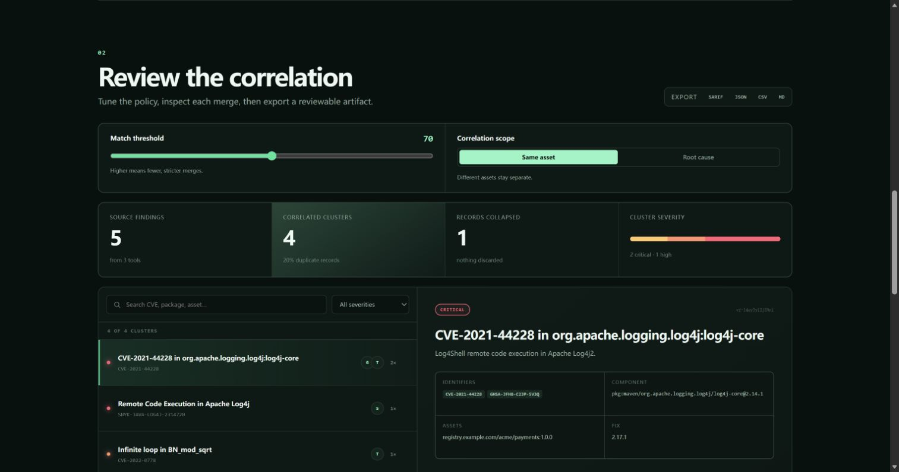

<div align="center">
  
  <h1>VulnFuse</h1>
  <p><strong>Stop triaging the same vulnerability three times.</strong></p>
  <p>Local-first, explainable correlation for SARIF, Trivy, Grype, Snyk, CycloneDX, OpenVEX, OSV-Scanner, and CSV reports.</p>

[](https://github.com/CAOShurong/vulnfuse/actions/workflows/ci.yml)
[](https://github.com/CAOShurong/vulnfuse/actions/workflows/codeql.yml)
[](LICENSE)
[](docs/THREAT_MODEL.md)

[Try the browser workbench](https://caoshurong.github.io/vulnfuse/) · [Why this exists](docs/RESEARCH.md) · [How matching works](docs/MATCHING.md) · [Supported fields](docs/FORMATS.md)
</div>



Security tools rarely describe the same issue in the same way. One scanner reports a CVE against a package URL, another uses a vendor advisory and an image layer, and a third emits a SARIF rule at a file location. Counting rows inflates the queue; blindly deduplicating them can hide real differences.

VulnFuse converts those reports into one canonical evidence model, scores plausible pairs, blocks unsafe merges, and keeps every source record attached to the resulting cluster. It is a correlation layer—not a scanner, vulnerability database, or false-positive oracle.

## What makes it useful

- **Eight input families, five outputs.** Read SARIF 2.1, Trivy JSON, Grype JSON, Snyk JSON, CycloneDX VDR/VEX, standalone OpenVEX, OSV-Scanner JSON, and ordinary CSV. Write VulnFuse JSON, SARIF, CSV, Markdown, or one self-contained interactive HTML file.
- **Every merge is reviewable.** Match edges retain the score, confidence, evidence, and exact reasons such as a shared CVE, PURL, asset, location, rule, or scanner fingerprint.
- **Conflicts are first-class.** Explicitly different vulnerability IDs, packages, assets, or finding kinds can block a merge even when titles look similar.
- **A bridge cannot bypass a conflict.** Candidate edges are considered strongest-first, and two clusters join only after every cross-cluster member pair passes the same hard-blocker policy.
- **Two honest scopes.** `instance` keeps different assets separate. `root-cause` can connect the same vulnerable component across images, repositories, or applications.
- **Baseline-aware gates.** Compare previous and current reports as `new`, `updated`, `unchanged`, or `absent`, then fail CI only when a genuinely new cluster crosses your severity threshold.
- **SARIF suppression stays auditable.** Preserve every suppression kind, status, and justification, but exclude a cluster from severity gates only when every source record is effectively suppressed.
- **SARIF outcomes remain distinct.** Keep valid `pass`, `informational`, and `notApplicable` records as reviewable non-finding evidence instead of counting them as active vulnerabilities.
- **Scanner disagreement becomes measurable.** See what each tool found alone, what several tools shared, and the pairwise overlap instead of comparing misleading raw totals.
- **A report people can actually review.** Portable HTML needs no server or CDN and includes local search, severity/state/asset/scanner/coverage/disposition filters, evidence, blockers, and every source record.
- **No report upload.** The hosted workbench runs entirely in the browser. The CLI and Action run in your own environment. No AI, API key, telemetry, or remote correlation service is required.
- **Deterministic output.** Identical input and policy yield stable finding and cluster IDs, which makes diffs and CI review practical.

## Quick start

### Browser

Open the [hosted workbench](https://caoshurong.github.io/vulnfuse/), drop two or more current reports, inspect the proposed clusters and scanner-overlap tables, and export the result. Add optional reports from a previous run to see a local baseline comparison. Choose **Load safe demo** to explore correlation, scanner divergence, and baseline states without using your own data.

### CLI from a release

VulnFuse currently requires Node.js 22.12 or newer. Install the two checksummed v0.4.12 packages directly from the GitHub release:

```bash
npm install --global https://github.com/CAOShurong/vulnfuse/releases/download/v0.4.12/vulnfuse-core-0.4.12.tgz https://github.com/CAOShurong/vulnfuse/releases/download/v0.4.12/vulnfuse-0.4.12.tgz
vulnfuse --version
```

The paired install matters because the CLI and shared core are separate packages. Every release also includes `SHA256SUMS.txt`, a CycloneDX SBOM generated from a fresh install of those exact CLI/core archives, and a separate CycloneDX SBOM for the bundled Action runtime.

### CLI from source

```bash
git clone https://github.com/CAOShurong/vulnfuse.git
cd vulnfuse
npm ci
npm run build

node packages/cli/dist/index.js merge \
  trivy.json grype.json snyk.json \
  --format markdown \
  --output vulnfuse-report.md
```

Use a quoted glob when scanner jobs produce many reports. VulnFuse expands it consistently instead of relying on the current shell:

```bash
vulnfuse merge "reports/**/*.json" --format html --output vulnfuse-review.html
```

Use forward slashes in portable patterns, including on Windows. Existing paths are treated literally before glob syntax, overlapping paths are deduplicated, directories and symbolic-link traversal are excluded, and an unmatched pattern fails instead of silently producing an empty result. The 1,000-report limit is applied after expansion, but a very broad pattern can still spend time traversing its starting directory tree; scope patterns to the report directory.

Inspect formats before merging:

```bash
node packages/cli/dist/index.js inspect trivy.json grype.json
```

Stream one input and fail CI when a high-severity active cluster remains:

```bash
cat osv-results.json | node packages/cli/dist/index.js merge - trivy.json \
  --scope root-cause \
  --format sarif \
  --output vulnfuse-results.sarif \
  --fail-on high
```

Run `node packages/cli/dist/index.js merge --help` for all policy and safety options.

For SARIF, `--fail-on` and `--fail-on-new` apply only to active clusters. A valid `pass`, `informational`, or `notApplicable` result with `level: none` or no explicit level is non-finding evidence; missing `kind` defaults to `fail`. A cluster is non-finding only when every member is non-finding. Separately, a non-empty suppression list containing only `accepted` or omitted statuses is effectively suppressed; any `underReview`, `rejected`, malformed metadata, or active corroborating record keeps the cluster active. Unknown, non-string, or contradictory result kinds also warn and remain active. These decisions trust producer metadata; VulnFuse does not rerun a rule, prove a check passed, validate applicability, or prove a finding safe or false.

Report-input and runtime failures print one concise diagnostic to stderr and return exit code 1. Add the global `--debug` option before the command when a stack trace is needed, for example `vulnfuse --debug inspect report.json`. Debug output can include local filesystem paths, so review it before sharing logs publicly.

The CLI and Action reject a file whose known size exceeds `--max-bytes` before reading its contents, then enforce the same limit while reading to cover file growth and unusual file types. Accepted report text, parsed findings, correlation state, and exports still consume additional memory; the byte limit is per report and is not a total-process memory or processing-time guarantee.

Both Node entry points write a requested report to a unique temporary sibling, flush it, and rename it into place only after the write succeeds. A reported write failure therefore leaves an existing complete destination untouched. A hard process or host failure can still leave a `.vulnfuse-*.tmp` sibling, and rename/crash durability depends on the local filesystem; this is not a power-loss or network-filesystem guarantee.

Compare current reports with a previous run and block only newly introduced high-severity clusters. Repeat `--baseline` for each previous scanner report:

```bash
node packages/cli/dist/index.js diff \
  --baseline previous/trivy.json \
  --baseline previous/grype.json \
  current/trivy.json current/grype.json \
  --format markdown \
  --output vulnfuse-baseline.md \
  --fail-on-new high \
  --fail-on-scan-set-change
```

The comparison preserves matched evidence and labels every cluster as `new`, `updated`, `unchanged`, or `absent`. It also records added or removed scanner tools and changed per-tool report counts in `scanSetChange`. A detected change prints a warning by default because `new` or `absent` states may reflect coverage drift; `--fail-on-scan-set-change` returns exit code 1 only after the complete comparison is written. Matching names and counts still do not prove that the asset, configuration, scanner version, or vulnerability database was identical. SARIF export writes the standard `baselineState` field for every result and the scan-set evidence in invocation properties.

Create a single portable report that a reviewer can open offline, search, filter, and expand without installing VulnFuse or sending evidence to a server:

```bash
node packages/cli/dist/index.js diff \
  --baseline previous/trivy.json \
  current/trivy.json current/grype.json \
  --format html \
  --output vulnfuse-review.html
```

The file contains its own styles and interaction code, makes no network requests, escapes report-controlled content, and keeps cluster and source-record evidence visible. Protect it like the original reports.

### GitHub Action

The Action accepts paths or newline-separated glob patterns. Generate scanner reports in earlier steps, correlate them, then upload the result as SARIF or retain it as an artifact.

```yaml
- name: Correlate scanner evidence
  id: vulnfuse
  uses: CAOShurong/vulnfuse@v0.4.12
  with:
    reports: |
      reports/trivy.json
      reports/grype.json
      reports/osv.json
    output: reports/vulnfuse.sarif
    format: sarif
    scope: instance
    fail-on: high

- name: Upload correlated SARIF
  if: always()
  uses: github/codeql-action/upload-sarif@v4
  with:
    sarif_file: reports/vulnfuse.sarif
```

To gate only new findings, download or otherwise provide the previous raw scanner reports and add:

```yaml
baseline-reports: previous-reports/*.json
fail-on-new: high
fail-on-scan-set-change: "true"
```

When a baseline is supplied, the selected output format contains the comparison instead of a plain correlation report. The Action warns when the scanner set changes and can fail after preserving the report. It writes a job summary and exposes `findings`, `clusters`, `active`, `suppressed`, `non-finding`, `duplicates-collapsed`, `single-tool`, `multi-tool`, `new`, `updated`, `absent`, `unchanged`, `scan-set-changed`, and `report` outputs.

## Supported input

| Format           | Parsed evidence                                                                 | Important boundary                                                             |
| ---------------- | ------------------------------------------------------------------------------- | ------------------------------------------------------------------------------ |
| SARIF 2.1        | runs, tools, rules, levels, result kinds, fingerprints, locations, suppressions | Security severity and producer-declared disposition are preserved              |
| Trivy JSON       | vulnerabilities, misconfigurations, secrets, packages, image targets, fixes     | Table and template output are not report inputs                                |
| Grype JSON       | matches, artifacts, PURLs, locations, advisories, fixes                         | The JSON schema has changed over time; fixtures cover the current common shape |
| Snyk JSON        | legacy `vulnerabilities`, identifiers, dependency paths, fixes                  | Snyk Code SARIF should be supplied as SARIF                                    |
| CycloneDX JSON   | components, vulnerabilities, ratings, affects, analysis/VEX context             | XML BOMs are not parsed yet                                                    |
| OpenVEX JSON-LD  | products, subcomponents, vulnerability aliases, status, justification, actions  | Status is retained as evidence, never trusted as a suppression verdict         |
| OSV-Scanner JSON | sources, packages, aliases, affected ranges, fixed events                       | Scanner output is accepted; arbitrary OSV records need the result wrapper      |
| CSV              | common ID, severity, component, PURL, asset, location, rule, and fix columns    | Header aliases are documented in [FORMATS.md](docs/FORMATS.md)                 |

## Matching at a glance

The default threshold is 70. Evidence adds points; incompatible evidence adds hard blockers.

| Evidence                                 |                Score |
| ---------------------------------------- | -------------------: |
| Shared vulnerability identifier          |                  +40 |
| Stable fingerprint from the same scanner |                  +55 |
| Same canonical component or PURL         |                  +25 |
| Same asset                               |                  +15 |
| Same file and nearby line                |           +10 to +15 |
| Same rule ID                             |                  +10 |
| Same finding kind                        |                   +5 |
| Similar meaningful title tokens          | up to +10 by default |

An explicit mismatch is not “negative points”; it can stop the merge. That conservative rule matters because a shared package does not make two different CVEs the same vulnerability. See [MATCHING.md](docs/MATCHING.md) for the complete policy, candidate indexing, confidence labels, and examples.

## Repository layout

```text
packages/core    canonical model, parsers, matching, correlation, exporters
packages/cli     Node.js command-line interface
packages/action  bundled Node 24 GitHub Action
apps/web         local-only React/Vite workbench deployed to GitHub Pages
docs             format contract, algorithm, architecture, and threat model
```

## Security and data handling

Scanner reports can contain repository paths, package inventories, hostnames, code locations, and sometimes secret fragments. Treat them as sensitive.

- The hosted app has no upload endpoint and makes no API call to process a report.
- File size, report count, pair-comparison, output overwrite, symlink traversal, URL scheme, and CSV formula-injection safeguards are built in.
- Uploaded strings are rendered as React text, not injected HTML.
- A correlation result does **not** prove that a vulnerability is exploitable, reachable, fixed, or a false positive.
- A SARIF suppression is producer-supplied review state. VulnFuse preserves and applies it to gates; it does not independently validate the justification or mutate an alert in GitHub or another platform.
- A SARIF non-finding kind is producer-supplied rule outcome. VulnFuse preserves and applies it to local gates; it does not rerun the check or prove the outcome or applicability.
- An OpenVEX status is a producer assertion. VulnFuse preserves it for review but does not authenticate the author, verify an attestation, prove reachability, or convert `not_affected` or `fixed` into a quiet gate bypass.
- GitHub code scanning does not document `result.kind` in its supported SARIF subset. VulnFuse therefore omits non-finding clusters from exported `results[]` and retains them under `run.properties.nonFindingClusters`; GitHub will not display those retained property records as alerts.

Read [THREAT_MODEL.md](docs/THREAT_MODEL.md) before using untrusted reports in automation. Report suspected vulnerabilities through the private process in [SECURITY.md](SECURITY.md).

## Project status

`v0.4.12` is a public alpha with explainable, cluster-safe cross-scanner correlation, standalone OpenVEX and CycloneDX VEX input, three-state SARIF disposition, scanner coverage/overlap analytics, scan-set-aware baseline comparison, and self-contained offline HTML review in the core library, CLI, browser workbench, and GitHub Action. Cluster-safe means that no proposed transitive merge is allowed to carry an existing hard blocker into one cluster; it does not mean that accepted correlations are independently proven ground truth. OpenVEX and CycloneDX support validates available PURLs and preserves producer context, but does not fetch external evidence, verify attestations or authors, or turn VEX status into a suppression verdict. Three-state disposition separates active findings, effectively suppressed findings, and producer-declared SARIF non-finding outcomes without deleting source evidence. It does not independently validate a suppression, rerun a check, establish applicability, or change hosted alert state. Scan-set awareness detects tool-name and report-count drift; it cannot establish that two scans used the same asset, configuration, scanner build, or vulnerability database. The core behavior is covered by synthetic cross-format fixtures, pinned public OpenVEX, CycloneDX, and Microsoft BinSkim samples, and end-to-end CLI/browser/Action checks, but real vendor output varies by scanner version. Please open a sanitized [format compatibility issue](https://github.com/CAOShurong/vulnfuse/issues/new?template=format.yml) when a legitimate report is not parsed correctly.

Near-term work:

- Add scanner-version fixtures contributed by users.
- Add CycloneDX XML and SPDX vulnerability extensions where a stable mapping exists.
- Publish signed npm packages after the package-distribution lifecycle is verified.
- Add policy files for organization-specific asset and component aliases.
- Benchmark very large monorepo and container-report sets.

## Contributing

The most useful contribution is a small, sanitized report fixture with the expected canonical fields. Read [CONTRIBUTING.md](CONTRIBUTING.md) before submitting data; never attach proprietary inventories, tokens, or live secrets.

Apache-2.0 licensed. Built to complement scanners and vulnerability-management systems, not replace them.
